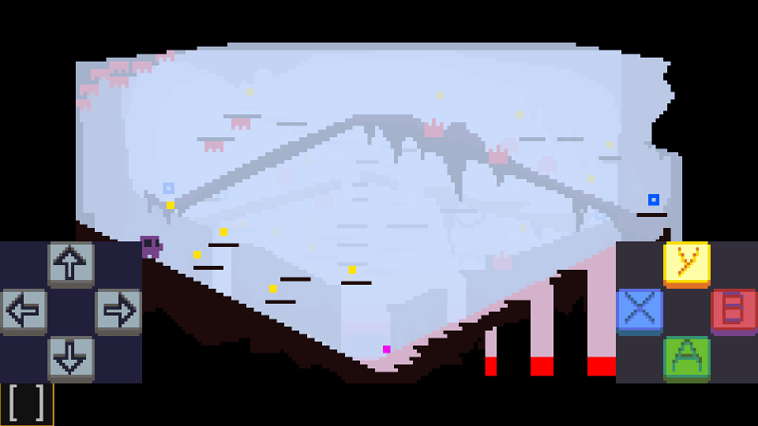

# ktg
kgt.js - Keyboard Touch and Gamepad library to ease Javascript Game Input Handling

# examples

- [a simple demo page](https://ericoporto.github.io/ktg/)

- [my ludum dare entry, adapted for **ktg**](https://ericoporto.github.io/ktg/example/rocambolli_ktgedition/)

# how to use
First, add to your html document:

    

Before using, you need to declare at some place:

    ktg.setup()

Whenever a key is pressed ktg_KeyPressed event is emitted, and when it's released,
ktg_KeyReleased is emitted. You can use event listeners on the window element.

    window.addEventListener('ktg_KeyReleased',  writeKeyUp,false);
    window.addEventListener('ktg_KeyPressed', writeKeyDown,false);

The key is passed as string under `event.detail` .

Alternatively you can monitor the keys under your gameloop using `isPressed`.

    if( ktg.isPressed(ktg.key.UP) ) {
      ...
    }

The possible keys by default are:

    ktg.key.LEFT
    ktg.key.UP
    ktg.key.RIGHT
    ktg.key.DOWN
    ktg.key.BUTTONA
    ktg.key.BUTTONB
    ktg.key.BUTTONX
    ktg.key.BUTTONY
  }

## ktg.setup details

ktg.setup accepts two parameters:

- `autoupdategamepad` : set this to `false` if you want to place your gamepad
update in your own loop, to ensure better precision. You will need to manually
call ktg.updateGamepad(). Default is `true`.

- `drawtouch` : set to `false`if you don't need the touch input functionality,
for example, if you detect that your game is in a desktop. Default is `true`.

Ex:

`ktg.setup(true, true)`

is the same as

`ktg.setup()`

## ktg.resize details

In case your game resizes, for example, by resizing the browser window, or going
fullscreen, you will need to deal with this. When you deal, just ensure to call
`ktg.resize()` to guarantee it will resize the touch input appropriately.

# Author

Made by Érico Vieira Porto

# License

Distributed under MIT license. See [`LICENSE`](LICENSE) for more information.
