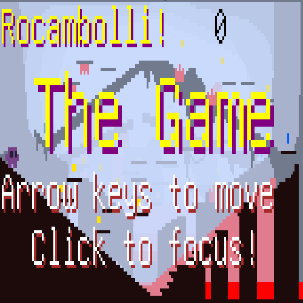

# Rocambolli

This is my first platformer. An entry to Ludum-Dare 37.

[You can play here on itch.io.](https://eri0o.itch.io/rocambolli)

Click on the screen when the game loads in itch, and then use **Arrow keys** and/or **WASD** keys to move the character.

You can also use a **Xbox360 gamepad**, using left stick to move and A or B to jump - it must be plugged in the USB as player1, which should be default, since the code is VERY hacky.

## Code

I am using my own codes below:

 - **[png-font](https://github.com/ericoporto/png-font) :** for pixel font drawing.

 - **[color.js](https://github.com/ericoporto/TouchyEngine/blob/master/color.js) :** tiny 1.47kb js for color normalization.

 I am also using Howler for sound:

 - **[howler.js](https://github.com/goldfire/howler.js) :** a lib for making audio on webpages easier.
  
## Assets
  
For generating sound assets I used the following:

 - **[BFXR](http://www.bfxr.net/) :** a sound creation tool that runs in browser.
 
 - **[BU's Autotracker](https://github.com/iamgreaser/it2everything/blob/master/atrk-bu.py) :** a python script that creates music by itself.
 
My tools for editing things:

 - **[Gedit](https://wiki.gnome.org/Apps/Gedit) :** All the JS code was written in Gedit.
 
 - **[Aseprite](https://github.com/aseprite/aseprite) :** Aseprite is the nicest tool ever written for drawing images. I used Aseprite for drawing - if you look my code you will see how drawing is everything in this game.

 - **[Audacity](http://www.audacityteam.org/) :** Audacity is how I edited and fine tuned the audio.
 
 - **[Schism Tracker](http://schismtracker.org/) :** I used this only to convert `.it` from BU's Autotracker to `.wav`.
 
## Thought process

This is my first entry to Ludum Dare and my first finished game alone. I decided to do a genre that's well known (platformers) but that I had never done.

The theme announced was ONE ROOM, and I thought on having all the game in a single screen, and the idea was that you could see all the game from first screen, in layers.

I decided on JS because it is the only thing I sorta know.

Then I decided to encode every information on the levels on the images, because I needed a fast way to create levels.

And the code is a tangle of mess, I threw every coding practice I learned to be able to finish the code in 25h - since I had other things to do this weekend.

And that's it. If you like, please star.

Questions, you can find me on [Twitter @eri0o](https://twitter.com/eri0o). 
